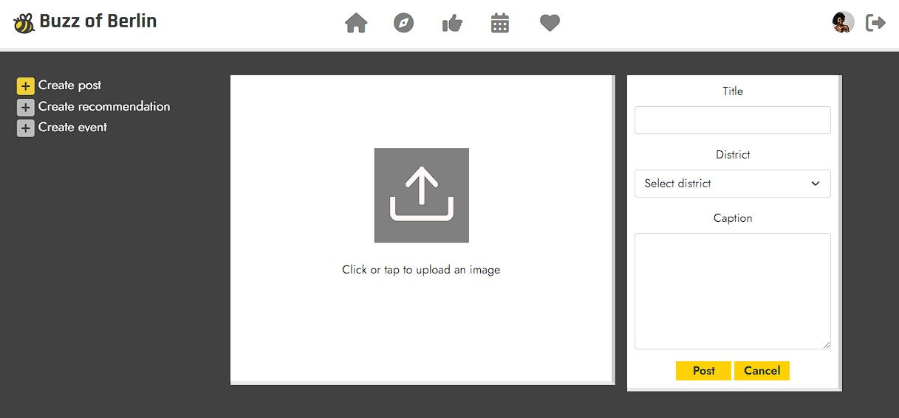
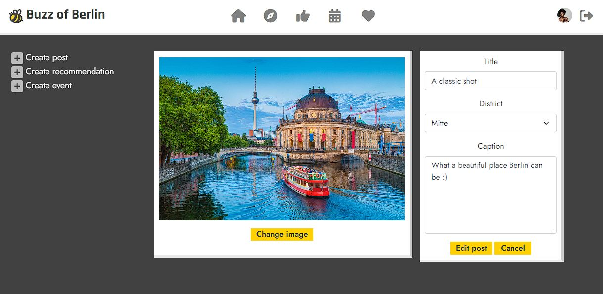
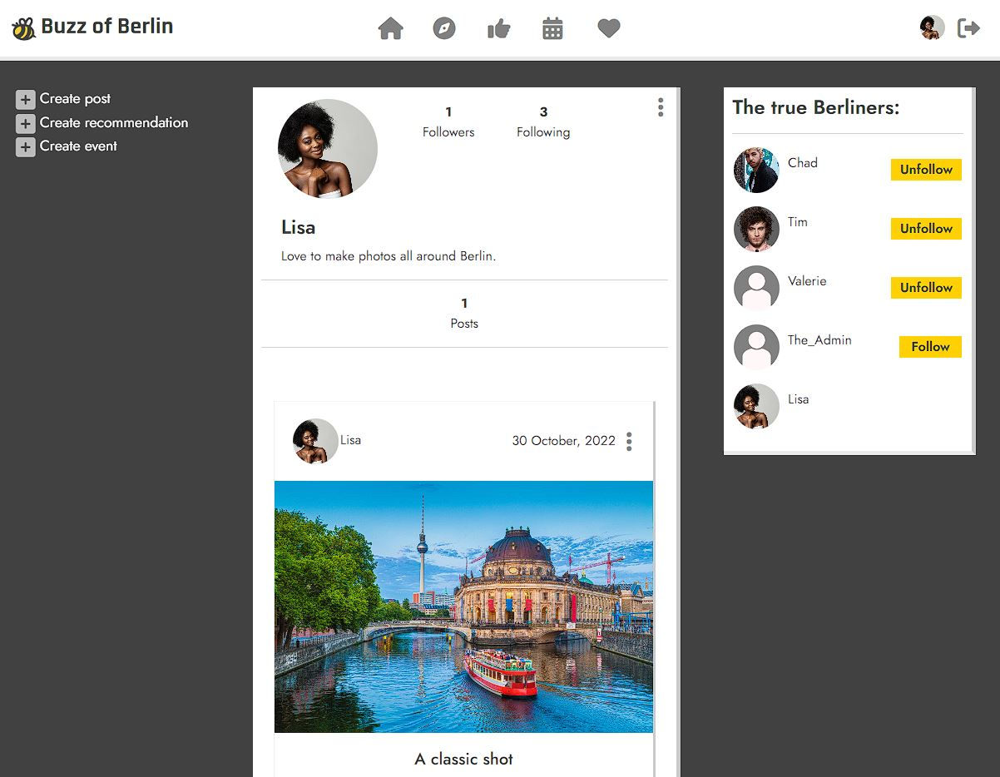

# Buzz of Berlin
(Developer: Vilayat Kleer)


[View the live application](https://.herokuapp.com/)

## Table of Contents

1. [Project Goals](#project-goals)
    1. [User Goals](#user-goals)
    2. [Application Owner Goals](#application-owner-goals)
2. [User Experience](#user-experience)
    1. [Target Audience](#target-audience)
    2. [User Requirements and Expectations](#user-requirements-and-expectations)
3. [User Stories](#user-stories)
    1. [User](#user)
    1. [Returning User](#returning-user)
    3. [Application Owner](#application-owner)
4. [Design](#design)
    1. [Colours](#colours)
    2. [Fonts](#fonts)
    3. [Structure](#structure)
5. [Technologies Used](#technologies-used)
    1. [Languages](#languages)
    2. [Framework](#framework)
    3. [Tools & Libraries](#tools--libraries)
6. [Features](#features)
7. [Validation](#validation)
    1. [HTML Validation](#html-validation)
    2. [CSS Validation](#css-validation)
    3. [JSX Validation](#jsx-validation)
    5. [Accessibility Wave WebAIM](#accessibility-wave-webaim)
    6. [Performance Google Lighthouse](#performance-google-lighthouse)
8. [Testing](#validation)
    1. [Manual Testing - User Stories](#manual-testing---user-stories)
    2. [Automated Testing](#automated-testing)
9. [Bugs](#Bugs)
10. [Deployment](#deployment)
    1. [GitHub](#github)
    2. [Heroku](#heroku)
11. [Credits](#credits)
    1. [Images](#images)
    2. [Code](#code)
12. [Acknowledgements](#acknowledgements)

## Project Goals

### About
Buzz of Berlin is a Berlin specific social media platform where Berliners can share their Berlin photos, favourite places in Berlin and favourite or personal events in Berlin. Every registered and logged in user can like other users' Posts and Recommendations, or leave a comment on them to share their thoughts and opinions. Users can also follow each other to stay up to date on their latest Posts. Posts, Recommendations and Events all contain a district field, making it easy to find your new favourite places and events to go to in Berlin. 

### User Goals
- Be able to share photos, favourite places and events with other Berliners
- Be able to interact with other Berliners on a Berlin specific social media platform
- Get inspired by other Berliners' photos and favourite places
- Find new events to go to in Berlin

### Application Owner Goals
- Create a Berlin speficic social media platform that helps bring Berliners together
- Provide users with the ability to share their Berlin photos with Posts, favourite places in Berlin with Recommendations and favourite or personal events in Berlin with Events
- Deliver an aesthetically pleasing design that makes users want to come back

## User Experience

### Target Audience
- People who live in Berlin
- Berliners who want to find new places to go to
- Berliners who want to find new events to attend
- Berliners who want to share their Berlin photos

### User Requirements and Expectations
- Fast application that is easy to use
- Responsive, aesthetic design that is responsive across all devices
- Providing a personal touch by displaying the users' profile image in the navigation bar

## User Stories

### Navigation
1. As a user I can see the navigation bar on every page so that I can easily navigate to different parts of the application
2. As a user I can use the navigation bar so that I can navigate to different parts of the application
3. As a user I can see my posts/recommendations/events being loaded automatically so that I can keep scrolling instead of clicking any buttons

### Authentication
4. As a user I can create an account so that I can start use all the features of the application
5. As a registered user I can log in so that I can start using the application
6. As a user I can log out of the application so that I can end my session if I choose to and keep my account secure
7. As a user I will stay logged into the application so that I can keep using the application until I decide to log out

### Posts
8. As a user I can create posts so that I can share photos I made in Berlin with other users
9. As a user I can edit my posts so that I can change the content if necessary
10. As a user I can delete my posts so that I can remove them if I want to
11. As a user I can like a post so that I can show other users that I like their content
12. As a user I can view all the posts that I liked so that I can revisit them 
13. As a user I can search posts so that I can quickly find posts
14. As a user I can view a posts' individual page so that I can read the comments left on the post
15. As a user I can browse posts of other users that I follow so that I can engage with them
16. As a user I can view posts of all of the applications' users so that I can find new users to follow

### Recommendations
17. As a user I can create recommendations so that I can share the best places in Berlin with other users
18. As a user I can edit my recommendations so that I can change the content if necessary
19. As a user I can delete my recommendations so that I can remove them if I want to
20. As a user I can like a recommendation so that I can show other users that I like their content
21. As a user I can view all the recommendations that I liked so that I can revisit them
22. As a user I can search recommendations so that I can quickly find recommendations
23. As a user I can view a recommendations' individual page so that I can read the comments left on the recommendation
24. As a user I can browse recommendations so that I can engage with them

### Events
25. As a user I can create events so that I can inform other users about event in Berlin
26. As a user I can edit my events so that I can change the content if necessary
27. As a user I can delete my events so that I can remove them if I want to
28. As a user I can search events so that I can quickly find events
29. As a user I can view a events' individual page so that I can view it in detail
30. As a user I can browse events so that I can find events in Berlin

### Comments
31. As a user I can create a comment so that I can engage with other users
32. As a user I can edit my comments so that I can update them if necessary
33. As a user I can delete my comments so that I can remove them from the post or recommendation if I want to
34. As a user I can see the date of any comment so that I can know whether a comment is new or old
35. As a user I can read other users' comments so that I can engage better with other users

### Profiles
36. As a user I can view a profile page so that I can find more content from that user
37. As a user I can edit my profile so that I can update my details
38. As a user I can change my username and password so that I can keep my account safe
39. As a user I can see who the most active and popular users are so that I can follow them for good content

## Design

### Colours
The colours I used for the application are based around the logo that I created early on in Adobe Illustrator. The main colours of the application are a dark grey (#414141), gold/yellow (#F0CF36) and white (#FFFFFF), with slight variations of those colours being used for accents or active/hover states. The gold/yellow colour is the main colour I picked from the logo to base the rest of the applications' colours. The dark grey and white create a nice contrast between all the components and keep everything easy to read, while the gold/yellow colour keeps the design interesting but not too busy.

<details><summary>Screenshot of main colours</summary>
    
</details>

### Fonts
The fonts that I used are [Rajdhani](https://fonts.google.com/specimen/Rajdhani) with a cursive fallback for the logo text and [Jost](https://https://fonts.google.com/specimen/Jost) with a sans-serif fallback for all other text elements.

### Wireframes
Wireframes have been created to speed up the development and design process. The home page wireframe has been used as a reference for all the other pages and feeds (explore feed, recommendations feed, events feed, liked page) and the create page wireframe has been used as a reference for all the create/edit pages (create/edit posts, create/edit recommendations, create/edit events).

<details><summary>Home page</summary>
    
</details>

<details><summary>Create page</summary>
    
</details>

## Technologies Used

### Languages
- [**HTML**](https://www.python.org/)
- [**CSS**](https://www.python.org/)
- [**JavaScript**](https://www.javascript.com/)

### Tools
- [**Git**](https://git-scm.com/) was used for version control
- [**GitHub**](https://github.com/) was used as a remote repository to store the all project files
- [**Gitpod**](https://gitpod.io/) was used as the IDE to write the project code
- [**Heroku**](https://dashboard.heroku.com/) was used to deploy the project
- [**Google Fonts**](http://pep8online.com/) was used to supply the fonts for my project
- [**Font Awesome**](https://fontawesome.com/) was used to supply the icons for my project
- [**WC3's Markup Validation Service**](https://validator.w3.org/) was used to validate my HTML code
- [**W3C's CSS Validation Service**](https://jigsaw.w3.org/css-validator/) was used to validate my CSS code
- [**Google Chrome's DevTools**](https://developer.chrome.com/docs/devtools/) was used to benchmark the applications' performance, accessibility, best practices and SEO
- [**Wave WebAIM's web accessibility evaluation tool**](https://wave.webaim.org/) was used to validate my Python code
- [**Am I Responsive**](http://ami.responsivedesign.is/) was used to create the mock-up image for this project
- [**Balsamiq**](https://balsamiq.com/) was used to create the wireframes for this project
- [**Adobe Illustrator**](https://www.adobe.com/products/illustrator.html) was used to create the logo
- [**Favicon.io**](https://favicon.io/) was used to create a favicon of my logo

### Libraries
- [**React 17.0.2**](https://17.reactjs.org/) was used to build the user interfaces
- [**React Bootstrap 4.6**](https://react-bootstrap-v4.netlify.app/) was used for the application layout, styling and making each component responsive.
- [**React Router**](https://v5.reactrouter.com/web/guides/quick-start) was used as for dynamic routing. I used it to allow for navigation between views of different components and to control what users see when they enter a specific URL in the browser.
- [**Axios**](https://axios-http.com/docs/intro) was used as the promise based HTTP client for node.js and the browser. I used it specifically to send API requests to the back end and to avoid any CORS errors when sending cookies.
- [**JWT**](https://jwt.io/) was used to create JSON Web Tokens. They were needed to prevent anonymous users from making extra network requests to refresh their access token, to remove timestamps from the browser when the users' refresh token expires or  when the user logs out.

## Front end
### React
React is a JavaScript library that is used for building interactive user interfaces. It uses declarative views to make your code easier to read and debug. The user interfaces consist of a collection of encapsulated and reusable components, allowing for complex user interfaces that are easy to manage thanks to separating the individual components.

React was used for several reasons:

- Reusability
    - Each time you write a component it can be reused in other parts of your application, or even in a completely new/different application. This saves a lot of time.
- Userbase and documentation
    - Since React is one of the most popular JavaScript libraries in the world, there is a plethora of of documentation and Stack Overflow questions for you to look at if you run into any errors. 
- Flexibility
    - Compared to other JavaScript libraries and front end frameworks, React code is easy to maintain and flexible thanks to its modular structure.
- Performance
    - React is already fast out of the box, but can be easily optimized by using components like the [react-infinite-scroll-component](https://www.npmjs.com/package/react-infinite-scroll-component) to avoid rerendering components over and over again when a user doesn't need them.
- React Bootstrap
    - The first time I used Bootstrap was around 2013/2014 and I have been using it on and off ever since. Being able to use Bootstrap with [React Bootstrap](https://react-bootstrap.github.io/) highly sped up the overall development process by being able to make the application responsive and aesthetic by applying its classes alongside my custom classes.

#### Components
The following components have been created and reused throughout the application:

- `<Asset />` 
    - A reusable component that renders differently depending on the props that are passed into it. Can render a spinner when content is still loading, an image with a src and alt attribute and/or a paragraph with a message.
- `<Avatar />` 
    - A reusable component that render user profile images. The props that it can take set the image source, image size, image dimensions (depending on where the component is rendered) and text (like the users' username).
- `<CreatePanel />` 
    - A reusable component that renders three NavLink components to allow users to create a Post, Recommendation or Event. Changes into a dropdown menu on small screens. When a user is logged out, it displays one NavLink component that links the user to the login page instead.
- `<DotsDropdown />`   
    - A reusable component that renders a dropdown menu on posts and comments, allowing users to edit or delete their posts or comments.
- `<ProfileEditDropdown />` 
    - A reusable component that renders a dropdown menu on use profile, allowing users to edit their profile information, username or password.
- `<NavBar />` 
    - A reusable component that renders a navigation bar, the content of which depends on whether the user is logged in or not.
    - Logged in users:
        - NavLink that links to the home page, displaying all posts of the users the logged in user follows
        - NavLink that links to the explore page, displaying all posts from all users
        - NavLink that links to the recommendations page, displaying all recommendations from all users
        - NavLink that links to the events page, displaying all events from all users
        - NavLink that links to the liked page, displaying only the posts and recommendations a user has liked
        - NavLink that links to the users' profile page, displaying the users' username, profile image, followers count, following count and all the users' created posts, recommendations and events
        - NavLink that links to the home page and signs out the user
    - Logged out users:
        - NavLink that links to the home page, displaying all posts from all users
        - NavLink that links to the events page, displaying all events from all users
        - NavLink that links to the log in page, allowing users to log in
        - NavLink that links to the sign up page, allowing users to create an account
- `<NotFound />`
    - A reusable component that renders the [no-results](link here) image along with a message to inform the user the page doesn't exist.

## Back end
## Django REST Framework
The front end is being supplied with data from the [Buzz of Berlin DRF API](https://buzz-of-berlin-drf-api.herokuapp.com/), which has been created using the Django REST Framework. The repository along with a README file can be found [here](https://github.com/vkleer/Buzz_of_Berlin_DRF_API).

## Features
The application has a total of 26 features:

### Logo and navigation bar
- Custom logo was created for this project, placed on the left as is conventional
- Contains the following links when logged in:
    - Home page (posts feed)
    - Explore feed
    - Recommendations feed
    - Events feed
    - Liked page (liked posts and recommendations)
    - Profile page
    - Sign out
- Contains the following links when logged out:
    - Home page (explore feed)
    - Events feed
    - Log in page
    - Sign up page
- Is present on every page
- Is responsive and works on all screen sizes
- Covers user story **1**, **2** and **6**

<details><summary>Screenshots of logo and navigation bar</summary>
    
    
</details>

### Sign up form
- Allows users to create an account
- Users must provide a valid username and enter their preferred password twice for confirmation
- Users cannot register the same username twice
- Covers user story **4**

<details><summary>Screenshot of sign up form</summary>
    
</details>

### Login form
- Allows registered users to login to their account
- Both the username and password have to be correct to be logged in
- Displays errors if the username or password is wrong or the input is invalid
- Covers user story **5**

<details><summary>Screenshot of login form</summary>
    
</details>

### Post create form
- Allows users to create their own posts
- Contains image, title, district and caption fields (caption is optional)
- The district field in particular allows users to find posts in their district easily using the search bar on other pages
- Allows users to share their Berlin photos with other users
- Covers user story **8**

<details><summary>Screenshot of post create form</summary>
    
</details>

### Post edit form
- Allows users to edit their existing posts
- Contains image, title, district and caption fields (caption is optional)
- Covers user story **9**

<details><summary>Screenshot of post edit form</summary>
    
</details>

### Post page
- Displays a single post
- Contains all of the posts details, including its comments
- Contains a like button to like and unlike the post
- Contains a dropdown menu on the post to allow the owner to edit or delete the post
- Covers user story **10**, **11**, **14**, **34** and **35**

<details><summary>Screenshot of post page</summary>
    
</details>

### Posts feed
- Contains all posts of users that the logged in user follows
- Has a search bar to allow users to search by username, title or district
- Covers user story **3**, **13** and **15**

<details><summary>Screenshot of posts feed</summary>
    
</details>

### Explore feed
- Contains all posts of all the users on the application
- Has a search bar to allow users to search by username, title or district
- Covers user story **3**, **13** and **16**

<details><summary>Screenshot of explore feed</summary>
    
</details>

### Recommendation create form
- Allows users to create their own recommendations
- Contains image, title, location name, district, entry fee, price category and content fields
- The location name and district fields in particular allows users to find recommendations more easily using the search bar on other pages
- Allows users to share their favorite places in Berlin
- Covers user story **17**

<details><summary>Screenshot of recommendation create form</summary>
    
</details>

### Recommendation edit form
- Allows users to edit their existing posts
- Contains image, title, location name, district, entry fee, price category and content fields
- Covers user story **18**

<details><summary>Screenshot of recommendation edit form</summary>
    
</details>

### Recommendation page
- Displays a single recommendation
- Contains all of the recommendations' details, including its comments
- Contains a like button to like and unlike the recommendation
- Contains a dropdown menu on the recommendation to allow the owner to edit or delete the recommendation
- Covers user story **19**, **20**, **23**, **34** and **35**

<details><summary>Screenshot of recommendation page</summary>
    
</details>

### Recommendations feed
- Contains all recommendations of all the users on the application
- Has a search bar to allow users to search by username, title, location name, district or entry fee
- Covers user story **3**, **22** and **24**

<details><summary>Screenshot of recommendations feed</summary>
    
</details>

### Event create form
- Allows users to create their own recommendations
- Contains image, title, location name, district, entry fee, price category and content fields
- The location name and district fields in particular allows users to find recommendations more easily using the search bar on other pages
- Allows users to share their favorite places in Berlin
- Covers user story **25**

<details><summary>Screenshot of event create form</summary>
    
</details>

### Event edit form
- Allows users to edit their existing posts
- Contains image, title, location name, district, entry fee, price category and content fields
- Covers user story **26**

<details><summary>Screenshot of event edit form</summary>
    
</details>

### Event page
- Displays a single event
- Contains all of the events' details
- Contains a dropdown menu on the event to allow the owner to edit or delete the event
- Covers user story **27**, **29**, **34** and **35**

<details><summary>Screenshot of event page</summary>
    
</details>

### Events feed
- Contains all recommendations of all the users on the application
- Has a search bar to allow users to search by username, title, location name, district or entry fee
- Covers user story **3**, **28** and **30**

<details><summary>Screenshots of events feed</summary>
    
    
</details>

### Liked page
- Contains all the posts and recommendations that the logged in user has liked
- Updates accordingly when a post or recommendation has been unliked
- Covers user story **12** and **21**

<details><summary>Screenshots of liked page</summary>
    
    
</details>

### Likes
- Allows users to like posts and recommendations to show they like a users' content
- Doesn't allow users to like their own content
- When liked, the like button will turn solid yellow and when not liked will turn outlined dark grey
- Covers user story **12** and **21**

<details><summary>Screenshots of likes</summary>
    
    
    
</details>

### Comments
- Allows users to leave a comment on a post or recommendation
- Comments can be edited or deleted
- Displays the date the comment was posted or edited
- All comments can be read by all other users, including logged out users
- Covers user story **31**, **32**, **33**, **34** and **35**

<details><summary>Screenshot of comments</summary>
    
</details>

### Popular profiles
- Displays the most followed users on the application
- Displays the users profile image and username
- Contains a follow/unfollow button next to the username on large screens
- Covers user story **39**

<details><summary>Screenshot of popular profile</summary>
    
</details>

### Profile page
- Any user can view any users' profile, including logged out users
- Contains a users profile image, username, followers count and following count
- Contains all of the users' created posts, recommendations and events
- Covers user story **36**

<details><summary>Screenshots of profile page</summary>
    
    
    
</details>

### Profile edit page
- Allows users to edit their profile image
- Allows users to edit their bio
- Covers user story **37**

<details><summary>Screenshot of profile edit page</summary>
    
</details>

### Profile edit username page
- Allows users to edit their username
- Covers user story **38**

<details><summary>Screenshot of profile edit username page</summary>
    
</details>

### Profile edit password page
- Allows users to edit their password
- Covers user story **38**

<details><summary>Screenshot of profile edit password page</summary>
    
</details>

### Not found page
- Displays the no-results image along with a message to inform the user the page doesn't exist

<details><summary>Screenshot of not found page</summary>
    
</details>

### Infinite scroll
- Allows users to scroll through their feeds without pressing any navigation buttons
- Used in the posts, recommendations and events feeds, liked page, profile page and comments
- No screenshot since it loads quickly, but can be seen when using the application
- Covers user story **3**

## Validation

### CSS Validation
All of the applications' module.css files have been validated using W3C's CSS Validation Service. They all passed with no errors or warnings. Since the validators' success message does not change depending on the CSS you feed it, I have included a single screenshot.

<details><summary>Screenshot of CSS validation</summary>
    
</details>

### JSX Validation
The JSX code of the application has been validated using ESLint. It passed with no errors or warnings.

<details><summary>Screenshot of components ESLint validation</summary>
    
</details>

<details><summary>Screenshot of contexts ESLint validation</summary>
    
</details>

<details><summary>Screenshot of hooks ESLint validation</summary>
    
</details>

<details><summary>Screenshots of pages ESLint validation</summary>
    
    
</details>

### Accessibility (Wave WebAIM)
The accessibility of the application has been measured using the Wave WebAIM web accessibility evaluation tool - all pages pass without errors.

<details><summary>Screenshot of home page accessibility evaluation</summary>
    
</details>

<details><summary>Screenshot of explore page accessibility evaluation</summary>
    
</details>

<details><summary>Screenshot of recommendations feed accessibility evaluation</summary>
    
</details>

<details><summary>Screenshot of events feed accessibility evaluation</summary>
    
</details>

<details><summary>Screenshot of liked page accessibility evaluation</summary>
    
</details>

<details><summary>Screenshot of profile page accessibility evaluation</summary>
    
</details>

<details><summary>Screenshot of create post page accessibility evaluation</summary>
    
</details>

<details><summary>Screenshot of create recommendation page accessibility evaluation</summary>
    
</details>

<details><summary>Screenshot of create event page accessibility evaluation</summary>
    
</details>

### Performance (Google Lighthouse)
The performance of the application has been measured with Google Lighthouse with a near perfect score.

<details><summary>Screenshot of Lighthouse performance</summary>
    
</details>


## Testing

### Manual Testing - User Stories

1. story

| **Feature** | **Action** | **Expected Result** | **Actual Result** |
|-------------|------------|---------------------|-------------------|
| feature | action | expected | result |

<details><summary>Supporting Screenshots - User Story 1</summary>
    
</details>

### Testing on Different Devices
The website has been tested on multiple physical devices without any issues:

- Desktop PC
- MacBook Pro 15"
- Google Pixel 6 Pro
- Samsung Galaxy S10
- Samsung Galaxy Note 10+

In addition to the physical devices, the website has also been tested without any issues by toggling all the different device options in Google Chrome's Developer Tools under the Device Toggling section.

## Bugs

| **Bug** | **Fix** |
|-------------|------------|
| bug | fix - [link to commit](https://github.com/vkleer/) |

## Deployment

### GitHub
This website was deployed using Github Pages with the following steps:

1. Go to your Github Repository
2. Navigate to the 'Settings' page
3. On the left hand menu under 'Code and automationo', click on 'Pages'
4. Under 'Source', click on the 'Branch' dropdown element and set it to your main branch (in my case, this branch is called 'main')
5. Click on 'Save'
6. Refresh the page and you will be provided with a link to your deployed Github Page.

If you want to fork this repository, follow these steps:

1. Go to the Github repository (https://github.com/vkleer/CI_PP4_WhatsCooking)
2. Click on the 'Fork' button in the top right corner under the navigation bar

If you want to clone this repository, follow these steps:

1. Go to the Github repository (https://github.com/vkleer/CI_PP4_WhatsCooking)
2. Click on the 'Code' button above the list of files
3. Select your preferred way of cloning, I recommend using the 'GitHub CLI' option
4. Under 'GitHub CLI', click on the copy button to copy the clone command
5. In you IDE, open Git Bash
6. Navigate to the working directory where you want to clone this directory
7. Paste in the clone command you copied and press the 'enter' key to create the clone

### Heroku
This React application has been deployed using Heroku with the following steps:

1. Login to [Heroku](https://id.heroku.com/login)
1. Go to your Heroku dashboard
3. In the top-right corner, click on the 'New' button, followed by the 'Create a new app' button
4. Enter an app name (it has to be unique) and choose your region under the 'Choose a region' dropdown menu.
5. Click on the 'Create app' button
6. In your projects package.json file, under scripts, add the following prebuild command:
    ```
    "heroku-prebuild": "npm install -g serve",
    ```
7. Create a Profile file at the root of your project and add the following web command to it:
    ```
    web: serve -s build
    ```
8. Make sure that the config vars in your back end app on Heroku are correct! The 'CLIENT_ORIGIN' should be set to the URL of the front end app Heroku app and the 'CLIENT_ORIGIN_DEV' should be set to the front end workspace URL.
9. Click on the 'Deploy' tab
10. Under 'Deployment method', click on 'Github'. You can then search for your repository under 'Search for a repository to connect to'
11. Click on the 'Connect' button to connect your repository
12. On the next page, under 'Choose a branch to deploy' you can choose the branch you want to deploy your app from
13. Either click on the 'Enable Automatic Deploys' button under 'Automatic deploys' to have the app deploy automatically on each push you make to the branch, or click on the 'Deploy Branch' button under 'Manual deploy'
14. Wait for the app to build and be deployed. Once the app is ready, a message will be displayed saying 'App was successfully deployed' along with a button which takes you to your newly deployed React app

## Credits

The logo and assets were created by the developer.

### Images
- This application was created for education purposes only. All of the images used for profile images and posts were sourced from Google to test out the application. I am therefore unable to provide the sources of all the pictures found on Google.

### Code
- 'Buzz of Berlin' is the result of building on the ['Moments'](https://github.com/Code-Institute-Solutions/moments) walkthrough that was provided by Code Institute. Though it was used as a foundation, a lot of extra functionality has been added to make this project truly my own. Code Institute has been credited throughout my code where applicable using docstrings.

## Acknowledgements
I would like to thank my partner Lauren Baker for helping me with the name of the application.